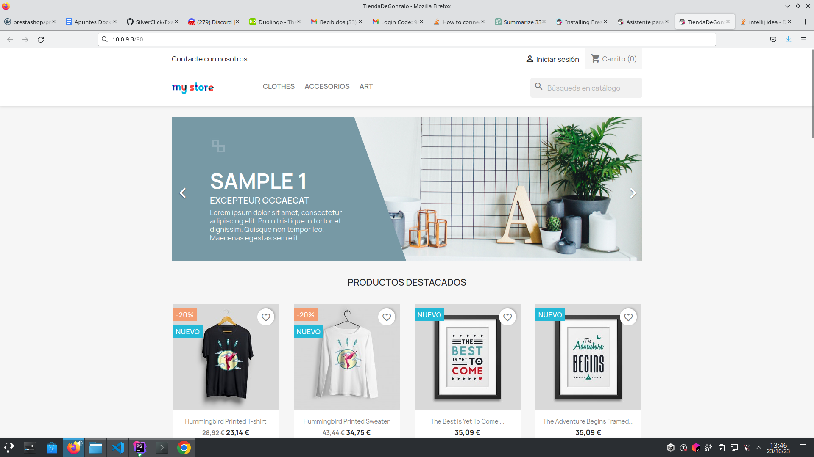

# Docker Compose para PrestaShop y MySQL

Este proyecto utiliza Docker Compose para configurar un entorno de desarrollo local con PrestaShop y MySQL. Sigue los pasos a continuación para poner en funcionamiento tu tienda PrestaShop.


## Paso 1: Configurar el archivo `docker-compose.yml`

Abre el archivo `docker-compose.yml` y ajusta los siguientes valores:

- `MYSQL_ROOT_PASSWORD`: La contraseña para el usuario root de MySQL.
- `MYSQL_DATABASE`: El nombre de la base de datos de PrestaShop.
- `MYSQL_USER`: El nombre de usuario para la base de datos de PrestaShop.
- `MYSQL_PASSWORD`: La contraseña para el usuario de la base de datos de PrestaShop.
 -  'image'
  container_name: prestashop
  environment:
  DB_SERVER: mysql
  DB_USER: prestashop_user
  DB_PASSWD: prestashop_password
  DB_NAME: prestashop_db
  ports:
  - "80:80"
  depends_on:

## Paso 4: Iniciar los contenedores

Ejecuta el siguiente comando en la terminal, estando en el directorio del proyecto:

```bash
docker-compose up -d
```


### Paso 

Esto iniciará los contenedores de MySQL y PrestaShop en segundo plano.

## Paso 5: Acceder a PrestaShop

Abre tu navegador web y ve a [http://localhost](http://localhost). Deberías ver la instalación de PrestaShop. Sigue las instrucciones para configurar tu tienda.


