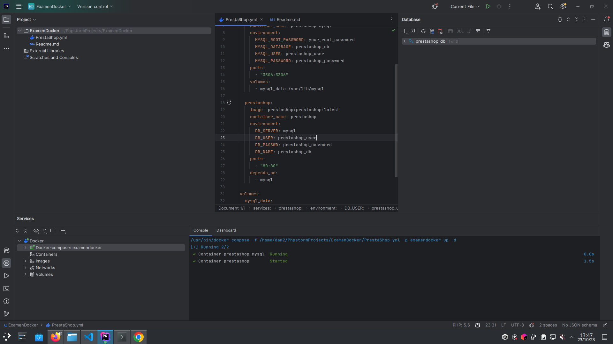

# Docker Compose para PrestaShop y MySQL

Este proyecto utiliza Docker Compose para configurar un entorno de desarrollo local con PrestaShop y MySQL. Sigue los pasos a continuación para poner en funcionamiento tu tienda PrestaShop.


## Paso 1: Configurar el archivo `docker-compose.yml`

Abre el archivo `docker-compose.yml` y ajusta los siguientes valores:

- `MYSQL_ROOT_PASSWORD`: La contraseña para el usuario root de MySQL.
- `MYSQL_DATABASE`: El nombre de la base de datos de PrestaShop.
- `MYSQL_USER`: El nombre de usuario para la base de datos de PrestaShop.
- `MYSQL_PASSWORD`: La contraseña para el usuario de la base de datos de PrestaShop.
- 
 -  'image' : La imagen de prestashop, en este caso cojeremos la ultima version.
  container_name: El nombre que queramos darle al contenedor
  environment:
  DB_SERVER: El servidor de base de datos que usemos, en este caso mysql 
  DB_USER: El usuario d ela base de datos, en este caso prestashop_user
  DB_PASSWD: La contraseña para el usuario de la base.
  DB_NAME: el nombre de la base de datos 
  ports: el puerto en el que pongamos prestashop, en este caso en el 80:80
 - depends on: que indica que depende de lo que escribimos arriba de la configuracion de mysql.
volume: el volumen donde se almacena toda la informacion de la base.


## Paso 4: Iniciar los contenedores

Ejecuta el siguiente comando en la terminal, estando en el directorio del proyecto:

```bash
docker-compose up -d
```


## Paso 5
En Php Storm o el Ide en el que estemos buscamos nuestra base de daros desde la interfaz en este caso mysql y la configuramos como en el yml, con el puerto 3306, el user prestashop_user y la contraseña prestashop_password ademas de 
el nombre de la base que en este caso sera prestashop_db



Esto iniciará los contenedores de MySQL y PrestaShop en segundo plano.

## Paso 6: Acceder a PrestaShop

Abre tu navegador web y ve a [http://localhost](http://localhost). Deberías ver la instalación de PrestaShop. Sigue las instrucciones para configurar tu tienda.


